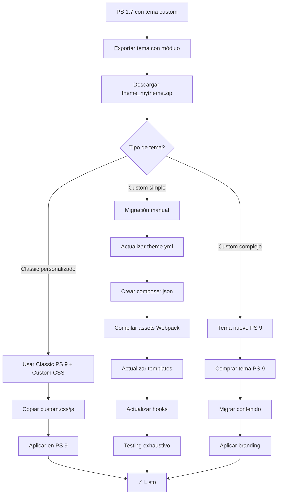

# 🎨 Guía de Compatibilidad de Temas PS 1.7 → PS 9

## ⚠️ ADVERTENCIA CRÍTICA

**Los temas de PrestaShop 1.7.x NO son directamente compatibles con PrestaShop 9.**

La migración de temas requiere **adaptación manual significativa** debido a cambios estructurales profundos en el core de PrestaShop.

---

## 🔍 Cambios Críticos entre PS 1.7 y PS 9

### 1. **Requisitos de PHP**

| Aspecto | PS 1.7.x | PS 9.x |
|---------|----------|--------|
| **PHP mínimo** | 7.1 | 8.1 |
| **PHP recomendado** | 7.4 | 8.2+ |
| **Incompatibilidades** | - | Muchas funciones deprecadas |

**Impacto en temas:**
- Módulos PHP del tema pueden fallar
- Funciones deprecadas causan errores
- Sintaxis PHP antigua no funciona

### 2. **Motor de Templates (Smarty)**

| Característica | PS 1.7.x | PS 9.x |
|---------------|----------|--------|
| **Versión Smarty** | 3.1.x | 4.x |
| **Sintaxis** | Compatible | Cambios menores |
| **Plugins** | Algunos deprecados | Nuevos requeridos |

**Cambios principales:**
```smarty
{* PS 1.7 *}
{l s='Text' mod='module'}

{* PS 9 - Nuevo sistema *}
{l s='Text' d='Modules.Module.Admin'}
```

### 3. **Estructura de Directorios**

#### PS 1.7.x:
```
themes/your_theme/
├── assets/
│   ├── css/
│   ├── js/
│   └── img/
├── config/
│   └── theme.yml
├── modules/
├── templates/
│   ├── _partials/
│   ├── catalog/
│   ├── checkout/
│   ├── customer/
│   └── layouts/
└── preview.png
```

#### PS 9.x (Similar pero con cambios):
```
themes/your_theme/
├── _dev/              ⭐ NUEVO - Archivos de desarrollo
│   ├── css/
│   ├── js/
│   └── webpack.config.js
├── assets/            ← Generados por Webpack
│   ├── css/
│   ├── js/
│   └── img/
├── config/
│   └── theme.yml      ⚠️ Formato actualizado
├── composer.json      ⭐ NUEVO - Obligatorio
├── modules/
├── templates/         ⚠️ Algunos cambios
│   ├── _partials/     ⚠️ Nuevos templates
│   ├── catalog/
│   ├── checkout/      ⚠️ Cambios significativos
│   ├── customer/
│   └── layouts/
└── preview.png
```

### 4. **theme.yml - Cambios Críticos**

#### PS 1.7.x (Ejemplo):
```yaml
name: mytheme
display_name: My Theme
version: 1.0.0
author:
  name: Developer
compatibility:
  min: 1.7.0
  max: 1.7.8
```

#### PS 9.x (REQUERIDO):
```yaml
name: mytheme
display_name: My Theme
version: 2.0.0  # ⚠️ Incrementar versión
author:
  name: Developer
  email: dev@example.com  # ⭐ NUEVO obligatorio
  url: https://example.com  # ⭐ NUEVO obligatorio
compatibility:
  min: 9.0.0  # ⚠️ CRÍTICO - Cambiar a 9.0.0
  max: 9.9.9
php_required: 8.1  # ⚠️ CRÍTICO - Mínimo PHP 8.1

global_settings:
  configuration:
    PS_IMAGE_QUALITY: jpg
  modules:
    to_enable:
      - ps_linklist
      - ps_customersignin
      # ... más módulos
```

**Nuevos campos obligatorios:**
- `author.email`
- `author.url`
- `php_required`
- `global_settings`

### 5. **Hooks - Cambios y Deprecaciones**

#### Hooks Deprecados en PS 9:
```php
// ❌ YA NO EXISTEN
displayNav           → displayNav1 / displayNav2
displayTop           → displayNavFullWidth
displayLeftColumn    → displayLeftColumnProduct
displayRightColumn   → displayRightColumnProduct
```

#### Hooks Nuevos en PS 9:
```php
// ✅ NUEVOS
displayAfterProductThumbs
displayProductAdditionalInfo
displayReassurance
actionFrontControllerSetMedia  // ⭐ Importante para assets
```

**Impacto:**
- Templates que usan hooks deprecados fallarán
- Módulos del tema no se mostrarán
- Layout puede romperse

### 6. **Sistema de Assets (CSS/JS)**

#### PS 1.7.x:
```
assets/
├── css/
│   └── theme.css  (compilado manualmente)
└── js/
    └── theme.js   (compilado manualmente)
```

#### PS 9.x (Webpack obligatorio):
```
_dev/
├── css/
│   └── theme.scss  ← Fuente SCSS
├── js/
│   └── theme.js    ← Fuente ES6+
├── package.json    ⚠️ Dependencias npm
└── webpack.config.js  ⚠️ Configuración

# Compilar con:
npm install
npm run build
# → Genera assets/css/theme.css y assets/js/theme.js
```

**Requisitos nuevos:**
- Node.js 16+
- npm / yarn
- Webpack 5
- Babel para ES6+

### 7. **Composer Dependencies**

#### PS 9 requiere composer.json:
```json
{
  "name": "yourvendor/mytheme",
  "description": "My PrestaShop 9 Theme",
  "type": "prestashop-theme",
  "license": "AFL-3.0",
  "require": {
    "php": ">=8.1",
    "prestashop/prestashop": "^9.0"
  },
  "config": {
    "preferred-install": "dist",
    "sort-packages": true
  }
}
```

### 8. **jQuery y Librerías JavaScript**

| Librería | PS 1.7.x | PS 9.x | Cambios |
|----------|----------|--------|---------|
| **jQuery** | 2.x | 3.5+ | Sintaxis actualizada |
| **Bootstrap** | 4.x | 5.x | ⚠️ Cambios críticos |
| **Font Awesome** | 4.x | 5.x/6.x | Iconos renombrados |

**Ejemplo de incompatibilidad Bootstrap:**
```html
<!-- PS 1.7 (Bootstrap 4) -->
<div class="form-group">
  <input type="text" class="form-control">
</div>

<!-- PS 9 (Bootstrap 5) -->
<div class="mb-3">  <!-- form-group NO existe -->
  <input type="text" class="form-control">
</div>
```

### 9. **Módulos del Tema**

Los módulos incluidos en el tema pueden ser incompatibles:

```
themes/mytheme/modules/
├── ps_customersignin/  ⚠️ Verificar compatibilidad
├── ps_contactinfo/     ⚠️ Puede haber cambiado
├── ps_currencyselector/ ⚠️ API cambió
└── ...
```

**Problemas comunes:**
- Módulos desactualizados
- APIs de PrestaShop cambiadas
- Hooks deprecados en los módulos

### 10. **Cambios en el Checkout**

El checkout en PS 9 tiene cambios significativos:

```
templates/checkout/
├── checkout.tpl           ⚠️ Estructura nueva
├── _partials/
│   ├── cart-summary.tpl   ⚠️ Campos nuevos
│   ├── cart-detailed.tpl  ⚠️ Formato cambiado
│   └── steps/             ⚠️ Pasos rediseñados
```

**Campos nuevos obligatorios:**
- RGPD checkboxes
- Nuevos métodos de pago
- Validaciones adicionales

---

## 🛠️ Proceso de Adaptación de Temas

### Opción 1: Migración Manual (Recomendada)

#### Paso 1: Exportar Tema desde PS 1.7
```bash
# En el módulo ps178to9migration
1. Ir a Modules → PS Migration 1.7 to 9
2. Sección "Export Theme"
3. Clic en "Export Active Theme"
4. Descargar: theme_mytheme_YYYY-MM-DD.zip
```

#### Paso 2: Extraer y Analizar
```bash
unzip theme_mytheme_YYYY-MM-DD.zip
cd theme/mytheme

# Leer instrucciones
cat ../README_MIGRATION.txt
cat ../theme_metadata.json
```

#### Paso 3: Actualizar theme.yml
```yaml
# Abrir config/theme.yml
# Actualizar campos obligatorios:
compatibility:
  min: 9.0.0
  max: 9.9.9
php_required: 8.1
author:
  email: tu@email.com
  url: https://tusitio.com
```

#### Paso 4: Crear composer.json
```bash
# En la raíz del tema
touch composer.json
```

```json
{
  "name": "yourvendor/mytheme",
  "description": "My Theme for PrestaShop 9",
  "type": "prestashop-theme",
  "license": "AFL-3.0",
  "require": {
    "php": ">=8.1",
    "prestashop/prestashop": "^9.0"
  }
}
```

#### Paso 5: Configurar Webpack
```bash
# Copiar estructura de Classic Theme PS 9
cp -r /path/to/ps9/themes/classic/_dev ./

# Instalar dependencias
npm install

# Compilar assets
npm run build
```

#### Paso 6: Actualizar Templates
```bash
# Revisar templates deprecados
grep -r "displayNav" templates/
grep -r "displayTop" templates/
grep -r "form-group" templates/

# Actualizar manualmente
```

#### Paso 7: Actualizar Hooks en PHP
```php
// En cualquier módulo del tema
// Buscar hooks deprecados:
grep -r "displayNav" modules/

// Reemplazar:
// displayNav → displayNav1
// displayTop → displayNavFullWidth
```

#### Paso 8: Probar en PS 9
```bash
# Copiar tema a PS 9
cp -r mytheme /path/to/ps9/themes/

# En PS 9 Back Office:
# Design → Theme & Logo → Seleccionar tema → Usar este tema
```

### Opción 2: Usar Classic Theme PS 9 (Más Simple)

Si tu tema 1.7 era basado en Classic:

1. **Instalar Classic Theme en PS 9** (viene por defecto)
2. **Copiar solo personalizaciones:**
   - `assets/css/custom.css`
   - `assets/js/custom.js`
   - Templates modificados específicos
3. **Recrear child theme** en PS 9
4. **Aplicar mismos estilos**

### Opción 3: Tema Nuevo (Recomendado para Producción)

Para tiendas importantes:

1. **Usar Hummingbird Theme** (nuevo tema oficial PS 9)
2. **O comprar tema compatible PS 9** en marketplace
3. **Migrar solo contenido y configuración**
4. **Aplicar branding (logo, colores)**

---

## 📋 Checklist de Compatibilidad

### Archivos Obligatorios
- [ ] `config/theme.yml` (actualizado para PS 9)
- [ ] `composer.json` (nuevo)
- [ ] `preview.png` (imagen del tema)
- [ ] `_dev/webpack.config.js` (si usa assets compilados)
- [ ] `_dev/package.json` (dependencias npm)

### Configuración
- [ ] `theme.yml` tiene `compatibility.min: 9.0.0`
- [ ] `theme.yml` tiene `php_required: 8.1`
- [ ] `theme.yml` tiene `author.email` y `author.url`
- [ ] `composer.json` existe y es válido
- [ ] Assets compilados con Webpack 5

### Templates
- [ ] No usa hooks deprecados
- [ ] Bootstrap 5 syntax (no form-group)
- [ ] Smarty 4 compatible
- [ ] Checkout actualizado
- [ ] RGPD templates incluidos

### JavaScript/CSS
- [ ] jQuery 3.5+ compatible
- [ ] Bootstrap 5 CSS
- [ ] Font Awesome 5/6
- [ ] Webpack compilado correctamente
- [ ] Sin errores en consola

### PHP
- [ ] Compatible PHP 8.1+
- [ ] No usa funciones deprecadas
- [ ] Módulos actualizados
- [ ] Hooks actualizados

### Testing
- [ ] Tema instala sin errores
- [ ] Home page carga correctamente
- [ ] Producto se muestra bien
- [ ] Checkout funciona
- [ ] Cart funciona
- [ ] Login/registro funciona
- [ ] Responsive funciona

---

## 🚨 Errores Comunes

### Error 1: "Theme is not compatible"
```
Causa: theme.yml tiene compatibility.min < 9.0.0
Solución: Actualizar theme.yml:
  compatibility:
    min: 9.0.0
```

### Error 2: "Composer.json not found"
```
Causa: Falta composer.json
Solución: Crear composer.json en raíz del tema
```

### Error 3: "Class not found" en PHP
```
Causa: Incompatibilidad PHP 8.1
Solución: Actualizar código PHP del tema
```

### Error 4: "Hook displayNav not found"
```
Causa: Hook deprecado
Solución: Reemplazar displayNav por displayNav1
```

### Error 5: "Assets not loading"
```
Causa: Assets no compilados con Webpack
Solución:
  cd _dev
  npm install
  npm run build
```

---

## 📊 Matriz de Decisión

| Situación | Opción Recomendada | Esfuerzo | Resultado |
|-----------|-------------------|----------|-----------|
| **Tema Classic personalizado** | Opción 2: Classic PS 9 + Custom CSS | Bajo | ⭐⭐⭐⭐ |
| **Tema custom simple** | Opción 1: Migración manual | Medio | ⭐⭐⭐ |
| **Tema custom complejo** | Opción 3: Tema nuevo PS 9 | Alto | ⭐⭐⭐⭐⭐ |
| **Tema marketplace** | Contactar desarrollador | Bajo | ⭐⭐⭐⭐ |
| **Tienda producción crítica** | Opción 3: Tema profesional PS 9 | Alto | ⭐⭐⭐⭐⭐ |

---

## 🎯 Recomendación del Módulo

El módulo `ps178to9migration` **exporta el tema** pero incluye:

1. **README_MIGRATION.txt** con instrucciones
2. **theme_metadata.json** con información del tema
3. **Todos los archivos del tema** en el ZIP

Sin embargo, **NO puede** automatizar la adaptación porque:

- ❌ Cambios en templates son específicos de cada tema
- ❌ Hooks deprecados requieren revisión manual
- ❌ CSS/JS pueden tener incompatibilidades
- ❌ PHP 8.1 puede romper código antiguo

### ✅ Lo que SÍ hace el módulo:

```php
// En MigrationService.php
public function exportTheme()
{
    // 1. Detecta tema activo
    // 2. Crea ZIP con todos los archivos
    // 3. Incluye metadata
    // 4. Incluye instrucciones de migración
    // 5. Avisa que requiere adaptación manual
}
```

### ⚠️ Lo que NO puede hacer:

- Actualizar theme.yml automáticamente
- Crear composer.json automáticamente
- Reemplazar hooks deprecados
- Actualizar Bootstrap 4 → 5
- Compilar assets con Webpack
- Garantizar PHP 8.1 compatibility

---

## 📝 Workflow Completo



---

## 🔗 Recursos Útiles

### Documentación Oficial
- [PrestaShop 9 Theme Docs](https://devdocs.prestashop-project.org/9/themes/)
- [Classic Theme PS 9](https://github.com/PrestaShop/classic-theme)
- [Hummingbird Theme](https://github.com/PrestaShop/hummingbird)
- [Theme Migration Guide](https://devdocs.prestashop-project.org/9/themes/getting-started/)

### Herramientas
- [Webpack 5 Docs](https://webpack.js.org/)
- [Bootstrap 5 Migration](https://getbootstrap.com/docs/5.0/migration/)
- [Smarty 4 Docs](https://www.smarty.net/docs/en/)
- [PHP 8.1 Migration Guide](https://www.php.net/manual/en/migration81.php)

### Marketplaces de Temas PS 9
- [PrestaShop Addons](https://addons.prestashop.com/en/3-templates-prestashop)
- [ThemeForest PrestaShop](https://themeforest.net/category/ecommerce/prestashop)
- [TemplateMonster](https://www.templatemonster.com/prestashop-themes.php)

---

## 💡 Conclusión

**La migración de temas de PS 1.7 a PS 9 NO es automática.**

### Para la mayoría de usuarios:
✅ **Recomendamos usar un tema compatible PS 9** (Classic, Hummingbird, o marketplace)

### Para desarrolladores avanzados:
✅ **La migración manual es posible** siguiendo esta guía

### El módulo ps178to9migration:
✅ **Exporta el tema** correctamente  
⚠️ **Pero requiere adaptación manual** después

---

**Última actualización:** 11 de diciembre de 2025  
**Autor:** Migration Tools Team  
**Versión del documento:** 1.0.0
